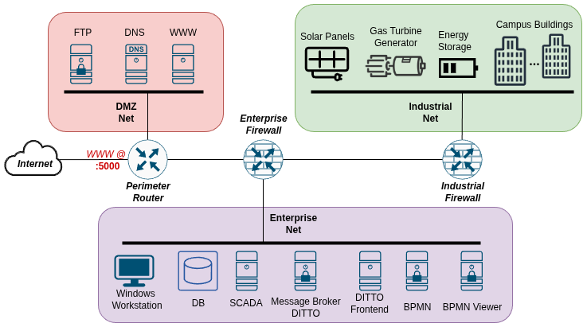

# Guide and Solutions

TODO: different levels of difficulty based on how much information is given. No help for hardest difficulty, progressively more info. The easies level should contain info about the network infrastructure such as layout and ip addresses.

TODO: Suggested goals of attack with their solutions

## Network Schema

  
Spoiler Alert

  

## Vulnerabilities

  
Spoiler Alert

 - Web: RCE

 - ScadaLTS: Privilege Escalation, RCE  (CVE-2022-41976, CVE-2023-33472 https://hev0x.github.io/posts/scadalts-cve-2023-33472/) 

 - Enterprise DB: Improper Authentication (CVE-2012-2122)

 - Windows: RCE (CVE-2019-0708)

 - OpenPLC: RCE (CVE-2024-34026)

 - WingFTP: RCE (CVE-2025-47812 https://www.exploit-db.com/exploits/52347)

