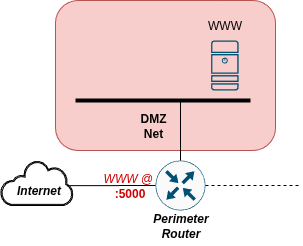
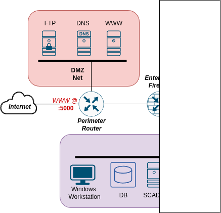
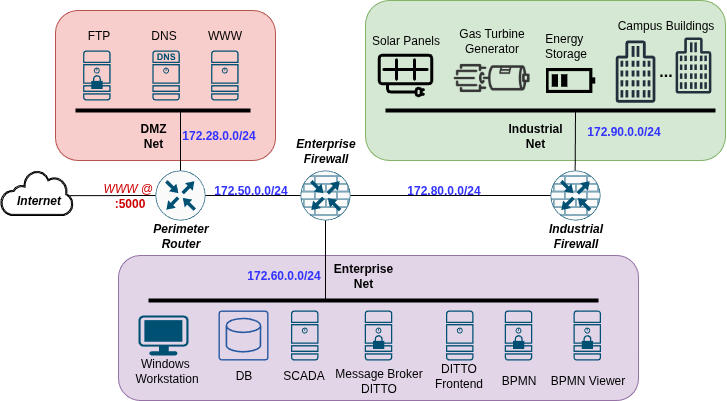
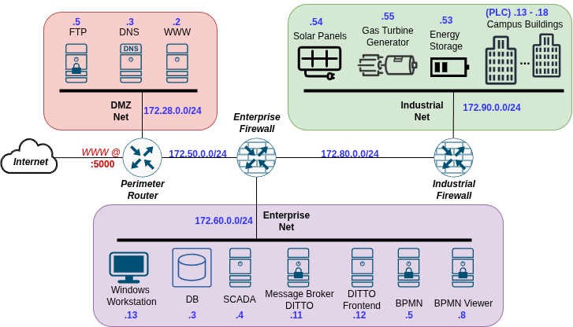

# Guide and Solutions

## Campaign Start and Rules

This section explains how to start you campaign against DVI. It will also show the rules you must follow regarding what you can do and what you can't do.

## Difficulty Chooser

Choose the Difficulty for your campaign against DVI. Inside, you will find all the information you are given to start. Choosing harder difficulties means you will receive less information compared to easier ones. 

The objectives to achieve are multiple, note that for harder difficulties you will not receive specific goals; you and your imagination are free to do what you want, from data exfiltration to denial of service and many more. Try to act and behave like a real hacker and find interesting goals to reach. If you choose easier difficulties you will receive some initial hints and suggestions.

Note: all the useful information are also accessible inside DVI! This is just for convenience and to facilitate the users. Also here you will find some guidelines and possible objectives to reach.

We suggest that you to start from the hardest difficulty, Impossible, and only look at easier ones if you are not able to continue.

All the information given for harder difficulties also apply for easier ones. This means that if you plan to play in Easy you have to read Impossible, Hard, Medium and finally Easy. Every level adds some more information to levels above.

After choosing the difficulty and reading all the information given to you, please remember to read the next section regarding the Rules.

#### Difficulties:

- 

  
VERY HARD

  
  Network Scheme: None

  Start your journey inside DVI at *localhost:5000*.

  There are no more information given for you.

  Good Luck!

- 

  
HARD

  

  The Network Scheme shows the Perimeter Router. You already know that there is a service at port 5000. That service is the Campus Website. It hosts some services for students as well as news and other useful information. 
  
  Looking at the schema there might be other servers inside the DMZ subnetwork and possibly also other subnetworks...

  Your first objective is to gain as much knowledge of the system as possible. The end goal is still unknown, maybe you will find something useful in the website. Find your way into the system through it and continue your work inside.

- 

  
MEDIUM

  

  Now you can take a look at the full DMZ subnetwork. You should check them for possible vulnerabilities or information on the network. Notice that there is a firewall next, if it is configured well it will be impossible to continue deeper, but what if it isn't...

  Now you can see that there is another subnetwork with a Windows machine, a database and another interesting service...

  Now that you have more to work with you can imagine your next moves. That database and Windows workstation surely hold confidential data, you should try to hack them. Also that other server might be crucial for future steps, explore the network and find what that server is.

  Looking at the schema it seems that there might be more in the network...

- 

  
EASY

  

  The full network schema shows the three subnetworks. 
  
  The DMZ net with three services used for the initial phase of the attack. Exploiting the webserver is the first step of you campaign, it is the only service exposed to the internet. The next step is the FTP server, the Enterprise Firewall has a small misconfiguration that allows traffic from FTP.

  Looking at the Enterprise Net, there are many objectives. The Windows Workstation can be a suitable end objective with the aim of stealing sensible information about the system. If instead you want to perform a more destructive attack you should investigate more the Scada and Ditto services and the ones linked to them. Also understanding how the BPMN service comes into play is crucial.

  The following is a brief description of the Energy Management System (EMS), it could be useful for your attacks:
  The EMS is a complex procedure to manage the electricity being produced and consumed inside the campus. The consuming parts are the Campus Buildings, each with its own energy consumption based on how busy they are. The producing parts are the Solar Panels and the Gas Turbine Generator. In the middle there is the Battery that accumulates the energy.

- 

  
VERY EASY

  

  The schema here shows the individual IPs for all the important hosts and networks.

  Before talking about the suggested attacks, you will be given a brief explanation of the whole infrastructure, how it works, what each service does and how they are connected togheter.

  The system is hosted inside the Campus DVI at DamnVulnerable University. It is composed of three main subnetworks: the DMZ Net hosts services such as the Web server, the DNS and the FTP server; the Enterprise Net hosts the Workstation, used by the technical staff, and all the servers that handle the Energy Management System (EMS); finally, the Industrial Net is comprised of the field devices (Battery, Solar Panels and Generator) and the Campus Buildings PLCs handling the power consumption inside the campus.

  The EMS is a complex procedure to manage the electricity being produced and consumed inside the campus. The consuming parts are the Campus Buildings, each with its own energy consumption based on how busy they are. The producing parts are the Solar Panels and the Gas Turbine Generator. In the middle there is the Battery that accumulates the energy.

  All the decisions are made automatically by the BPMN service. It is started by another host (not directly shown in the Network Schema) that calls the BPMN server starting the procedure. This procedure can be viewed inside the BPMN viewer. It computes all the consumptions and decides if it is necessary to start the Gas Turbine or not, and decides if it is required to discharge the battery in case the energy produced by the Solar Panels is not enough. The BPMN procedure gets its source data from SCADA.

  The communication is handled by the Message Broker DITTO; it gets datapoints from the field devices and acts as an aggregator for the SCADA server. DITTO is accessible through the DITTO Frontend that takes care of the credentials. 
  Inside SCADA the technicians are able to manually start/stop the turbine, inspect all the consumptions and even switch off entire buildings inside the campus. The Enterprise DB is where SCADA stores all the data.

  All the hosts inside the network use the internal DNS server.
  

  ### Attacks

  Now you are ready to start your campaign inside DVI!

  You already know that the first step of your attack is the Webserver that is accessible at port 5000 thanks to Port forwarding on the Perimeter Router. Inside that you will find many useful information, take your time to acquire as much knowledge as possible.

  #### Webserver Takeover

  To exploit it you have to look for a tool that allows you to execute commands directly on the machine. You could use it to send commands or even open a Reverse Shell. The vulnerable service writes files on the disk, you have to leverage this for your exploit. You should expect some level of defence, sanitization or firewall.

  #### FTP Takeover

  The next step is the FTP server. Be ready to acquire the version of that service and look for possible known vulnerabilities. Also you are required to solve a login to proceed forward.

  These two steps are necessary for all further objectives. From now on you can do whatever you want. You could imagine an attack to the DNS, to the Windows machine stealing some fictitious data or some more critical attacks.

  The following are the proposed final objectives (solutions to the first two steps and the following can be found in the Solutions section).

  #### Data Exfiltration

  In this scenario you have to exfiltrate sensitive data stored inside two possible hosts: the Enterprise Database and the Windows Workstation. This goal is considered to be completed if you manage to access and steal *some generic* data from either one of the two.

  There is no *actual* sensitive data to target and try to steal but you can imagine for example a log file to be the file you are trying to exfiltrate.

  #### Workstation Takeover

  Your goal is to take control of the Windows Workstation. You are asked to scan the network, find the machine, exploit the Remote Desktop Protocol and execute some sort of command. This objective is considered to be completed if you are able to violate the machine and execute *some generic* command from terminal.

  #### PLCs Takeover

  This scenario demands you to take control of the PLCs exploiting some vulnerability present in the protocol used or leveraging default/insecure credentials. This objective is considered to be completed if you are able to show proof of an RCE inside a PLC of your choice.
  
  #### Infrastructure Takeover

  This is the biggest and most complex proposed goal inside DVI.

  You as the attacker are required to take control of the whole infrastructure. Your main objective is to disrupt the Energy Management System. Your final targets are a potential Blackout inside the University Campus by emptying the Battery; another target is the Explosion of the Gas Turbine if you can manage to keep it running indefinetly.

  To reach these goals you have plenty of freedom. You could attack the SCADA service, you could perform a Man-in-the-Middle attack acting as the Message Broker DITTO, or lastly you could even violate the BPMN procedures.

## Rules

This section contains the rules that you must follow inside DVI.

 1. You MUST access DVI through PORT 5000 only. All the other ports are to be used for Debug/Management tasks.

 2. You MUST NOT access any router/firewall interface, edit any of their configuration. Routers and Firewalls are OUT OF SCOPE for this scenario.

 3. You MUST NOT access any container through docker (like accessing specific containers, editing ip addresses, etc).

 4. You MUST NOT access the Windows machine through its VNC Web interface.

 5. You MUST NOT access the FTP Administration panel.

 Remember that: What is not forbidden is permitted!

 Good luck!

## Solutions

This section contains the credentials, the steps and other tips necessary to solve the scenario.

It shows possible goals/objectives with attack steps to reach them. Note that you can also come up with your own objectives.

Open and read this only after trying to solve DVI yourself.

  
Spoiler Alert

  Note: The first two attacks are common for all the other attacks. All the end objectives require you to first violate the Webserver and then the FTP server. After that you will be able to 'bypass' the firewall leading into the Enterprise Net and the Industrial Net. This is because the firewall allows the FTP traffic to the internal networks. This means that your attack has to necessarily pass through the Webserver, then FTP and finally whichever internal host you want.

  #### Webserver Takeover

  The server contains many information about the system. Some are contained inside comments in the HTML. You can read them by inspecting the page.

  The vulnerability lies in the Private section. The only service available is the 'Change your password' page. The users are stored directly inside the filesystem in the *passwords* directory. The *username.txt* is the filename while the password is hashed using MD5 and stored inside it. To exploit it you have to firstly find a correct username:password combination. That is achievable by using *alice* as the username (remember that Alice is found inside the website as the person to contact). The password is *abc123*, a simple password that is surely available in any wordlist.

  Now comes the real exploit. The code that executes the password change is not completely secure. It sanitize the username in a naive way. It truncates the username to retrieve the current password, meaning that if you type *alice.whatever*, it just look for the user *alice*. But when it goes to write the new password it does not use the same sanitized variable; instead it just tries to remove *.php* from the string. The exploit is achieved by simply using the following username *alice.ph.phpp*. The final username used for writing will be *alice.php*. If you are able to write inside the file you can execute the code visiting */passwords/alice.php*.

  Since new passwords are hashed this seems impossible. Fortunately "the students" who developed this functionality introduced a big security flaw; adding *RAW:* at the start of the new password allow you to bypass the hashing meaning that you can write whatever you want.

  A possible exploit can be found at [Exploit](./DVI_dind/framework/web/README.md).

  #### FTP Takeover

  The FTP server offers the standard port 21 as well as a Web interface at port 80. This Web interface is vulnerable to Unauthenticated Remote Code Execution (RCE) during Login. 

  The user is *administrator* with password *StrongPassword123*. This should not be necessary since the vulnerability does not require authentication.

  Citing the Exploit: 
  "Description: Wing FTP Server versions prior to 7.4.4 are vulnerable to an unauthenticated remote code execution (RCE) 
  flaw (CVE-2025-47812). This vulnerability arises from improper handling of NULL bytes in the 'username'
  parameter during login, leading to Lua code injection into session files. These maliciously crafted
  session files are subsequently executed when authenticated functionalities (e.g., /dir.html) are accessed,
  resulting in arbitrary command execution on the server with elevated privileges (root on Linux, SYSTEM on Windows).
  The exploit leverages a discrepancy between the string processing in c_CheckUser() (which truncates at NULL)
  and the session creation logic (which uses the full unsanitized username)."

  The full exploit can be found at [Exploit](https://www.exploit-db.com/exploits/52347).

  ---

  Once you have gained access and full control of both the Web server and FTP server you are ready to proceed.

  #### Data Exfiltration

  To reach this goal you are required to steal some generic data/file from either the Enterprise Database or the Windows Workstation.

  The former can be violated thanks to its vulnerability of Improper Authentication (CVE-2012-2122).

  The latter can be exploited using a vulnerability in the Remote Desktop Protocol (RDP) that leads to an RCE (CVE-2019-0708).

  #### Workstation Takeover

  As per the goal above, you have to exploit the same vulnerability of Windows RDP (CVE-2019-0708).

  #### PLCs Takeover

  To gain control of the PLCs you have to exploit a Buffer Overflow vulnerability that can lead to an RCE.

  More information can be found [here](https://talosintelligence.com/vulnerability_reports/TALOS-2024-2005) (CVE-2024-34026).
  
  #### Infrastructure Takeover

  The full Infrastructure Takeover can be achieved in various different ways. What follows is just a suggestion but you can decide to try another approach if you prefer.

  The attack is performed against the SCADA server running a vulnerable version of ScadaLTS. The vulnerability allows the attacker to perform an RCE (CVE-2023-33472). The exploit can be found [here](https://hev0x.github.io/posts/scadalts-cve-2023-33472/).
  This exploit requires to know the credentials which are insecure; Username: *admin* and Password: *admin*.

  After being able to take control over SCADA you are able to control everything inside the system. To try acting more like a real attacker you can try to be as stealth as possible, meaning that logging in and powering things off will not be considered completely correct.

  To finish up the attack you can implement a Man-in-the-Middle attack where you act as the Message Broker DITTO. To do so you could poison the DNS records or add a specific rule inside SCADA pointing to your Fake DITTO server.
  
  You can send fictitious and malicious data to SCADA/BPMN letting them think that the field devices are in a different state w.r.t. the reality. You can also directly forge messages to field devices while blocking the real commands.

## Vulnerabilities

This section contains the full list of vulnerabilities present inside DVI. Some refer to a specific CVE code and a couple also contain a link to known exploits.

For the true experience with DVI, you are asked NOT to read this section. If you feel lost you can come back here after trying for a while by yourself.

  
Spoiler Alert

 - Web: RCE ([Exploit](./DVI_dind/framework/web/README.md))

 - ScadaLTS: Privilege Escalation, RCE  (CVE-2022-41976, CVE-2023-33472 https://hev0x.github.io/posts/scadalts-cve-2023-33472/) 

 - Enterprise DB: Improper Authentication (CVE-2012-2122)

 - Windows: RCE (CVE-2019-0708)

 - OpenPLC: RCE (CVE-2024-34026 https://talosintelligence.com/vulnerability_reports/TALOS-2024-2005)

 - WingFTP: RCE (CVE-2025-47812 https://www.exploit-db.com/exploits/52347)

## Debug/Management

This section contains all the Debug/Management data and entrypoints.

DO NOT refer, use or rely on ANY of the information written here for you campaign against DVI. Everything you find here is to be used for debug.

  
Spoiler Alert

  Services associated to Ports exposed:

      - 5000:5000 # Web -> (Credentials for 'Change your password') User: alice, Pass: abc123
      - 5001:5001 # Scada -> User: admin, Pass: admin
      - 5002:5002 # BPMN viewer -> User: admin, Pass: admin
      - 5003:5003/tcp # Windows RDP -> User: Docker, Pass: admin
      - 5003:5003/udp # Windows RDP
      - 5004:5004 # Windows VNC
      - 5005:5005 # Empty/Free
      - 5006:5006 # FTP Admin Panel (Port 5466) -> User: admin, Pass: wingftp
                  # FTP Default (Port 21, 80) -> User: administrator, Pass: StrongPassword123
      - 8081:8081 # LuCI perimeter -> No User/Pass required
      - 8082:8082 # LuCI enterprise -> No User/Pass required
      - 8083:8083 # LuCI industrial -> No User/Pass required

  All these services, apart from Web at port 5000, are NOT TO BE USED during your activities inside DVI.

  BUT, if you want to check at those before/after/during your campaing, you can do this accessing *localhost:PORT*.

