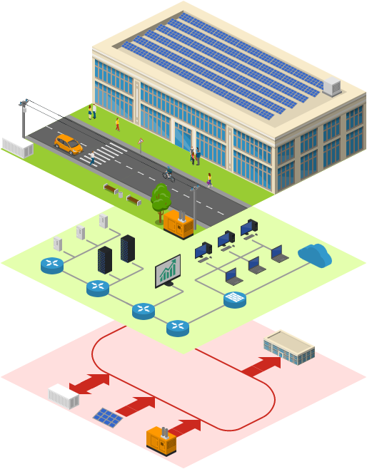

# Damn Vulnerable Infrastructure (DVI)

## Introduction

This project realizes a Damn Vulnerable Infrastructure with many vulnerable containers. It allows, and actually requires, the attacker to perform various lateral movements in order to reach its goal.

The system implements the Energy Management System (EMS) of Campus Savona at Università di Genova. For the full description refer to the [GUIDE.md](./GUIDE.md).

The attacker will get in the system through the web server. Exploring the website will give the user the ability to gain open source intelligence about the infrastructure, some hints about the network layout, some of the key nodes and some tips that might be useful for later attack steps.

The whole system runs inside a Docker-in-Docker container (dind). It is possible to run it directly on the host by simply executing the compose file inside the directory DVI_dind.

This project is a perfect cyber range for penetration testers and students. It gives the attacker the ability to perform various types of attack, but most importantly it requires several lateral movements to reach the end goal.

This scenario can be "played" in many different levels of difficulty based on how much information you read from the [GUIDE.md](./GUIDE.md). Inside it you will find the levels of difficulty. You can choose one and read the details.

The Guide can be helpful if you want a hint on how to start tackling this scenario. Remember that you will be able to "play" even without reading the Guide. All the relevant information can be found inside the website.

## Full Guide and Solutions

Available at [GUIDE.md](./GUIDE.md)

## Requirements

Makefile is used to perform all actions on the system.

Docker and Docker Compose version >=2.30.0 are required.

### Specific requirements of containers

Containers must have access to the following commands: *ping*, *ip*. This is to perform healthchecks and setup each container during startup.

The Windows container requires internet access to download the ISO. Remember to let it connect to internet without limiting the firewalls.

If you want to extend the network adding a container make sure that these commands are available. Instructions to extend the infrastructure are given below.

## Steps to run

- *make up* (starts Dind, i.e. the outer container that hosts all the infrastructure)

- *make dvi-build* (builds all the containers)

- *make dvi-start* (starts dovesnap service and all the containers), if for some reason this process is not able to start correctly all the infrastructure you should execute *make dvi-down* and then repeat *make dvi-start*

- *make dvi-ps* (alias for docker compose ps inside dind), before starting to work on DVI we suggest to check with this command that every container is healthy. Even in this case some strange behaviours could arise, if so you can try to restart from scratch by *make rm* removing Dind

### Steps to pause/unpause

There is the possibility to pause and unpause all the containers. Use *make dvi-pause* to pause and *make dvi-unpause* to unpause. It is useful to pause instead of stop because the starting process might not be reliable. This way you can be sure that everything will continue working after pause/unpause.

### Full list of Make commands

Note that all commands starting with *dvi-* are executed inside Dind.

- up (starts Dind)

- stop (stops Dind)

- rm (removes Dind container, useful to remove everything and restart)

- inside (utility command to enter Dind and manually inspect and operate on the infrastructure)

- dvi-start (starts the infrastructure DVI via the start.sh script)

- dvi-pause (pauses DVI)

- dvi-unpause (unpauses DVI)

- dvi-stop (stops DVI)

- dvi-down: (down --volumes DVI)

- dvi-build (builds DVI)

- dvi-ps (alias for docker ps inside Dind)

- dvi-dovesnap-up (run automatically with dvi-start, starts Dovesnap)

- dvi-dovesnap-down (down --volumes Dovesnap)

- dvi-sysctl (run automatically with dvi-start, executes sysctl tweak script)

## Instructions to extend

TODO

